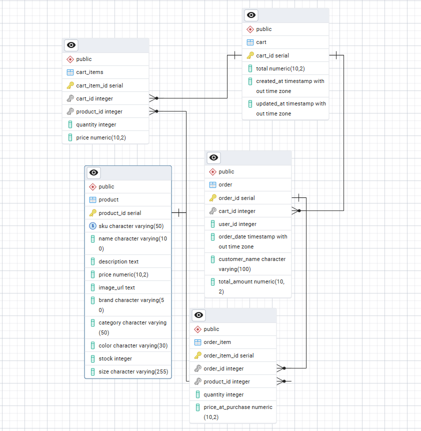

# GoodShoe – Full-Stack E-Commerce Platform

**Course:** CSC471 – Fall 2025  
**Tech Stack:** Laravel, PHP, Blade, PostgreSQL, MVC  

StepLab is a full-stack e-commerce web application designed to simulate a shoe store. It allows users to browse products, add items to a shopping cart, and complete orders, while admins can manage inventory and products.

---

## Features

### User Features
- Browse products on **Product Listing Page**  
- View detailed information on **Product Detail Page**  
- Add, update quantity, or remove items from the shopping cart  
- Checkout workflow with shipping information collection and order creation  

### Admin Features
- Full **CRUD operations** for products  
- Inventory management and SKU tracking  
- Secure authentication for admin access  

### Database & Backend
- **PostgreSQL** relational schema for Products, Carts, Orders, and Order Items  
- Enforced data integrity using foreign keys, cascading deletes, and unique SKU constraints  
- Laravel MVC architecture with Blade templates for views  
- RESTful routing for backend operations
  
## Database Architecture

